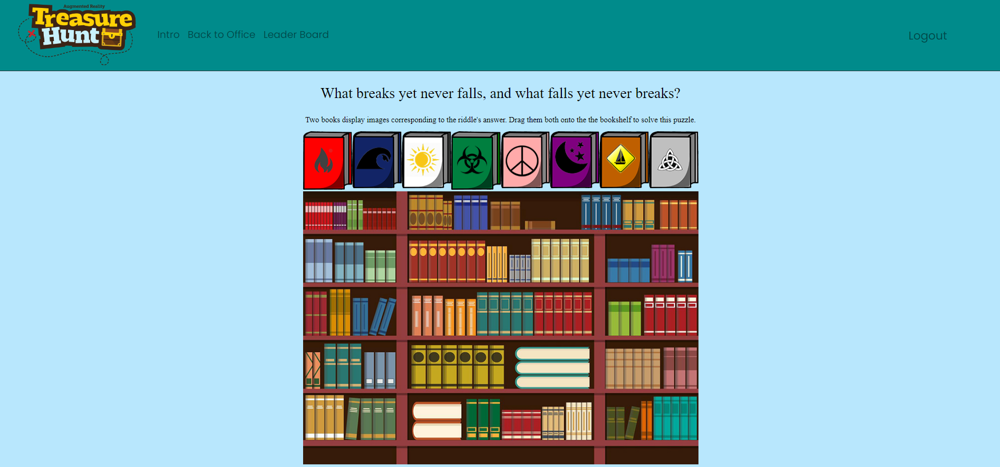
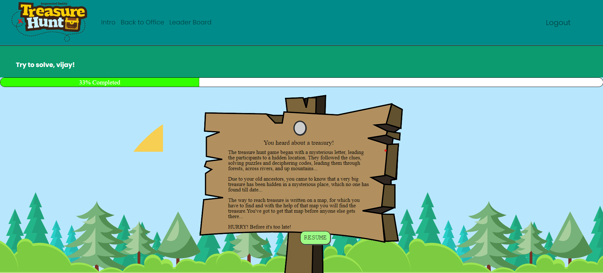
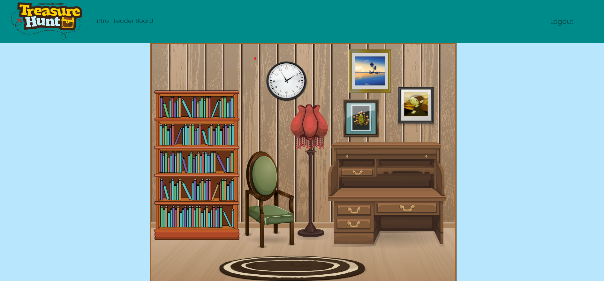
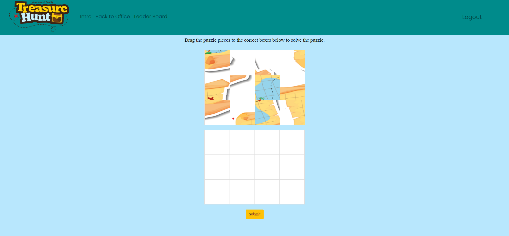
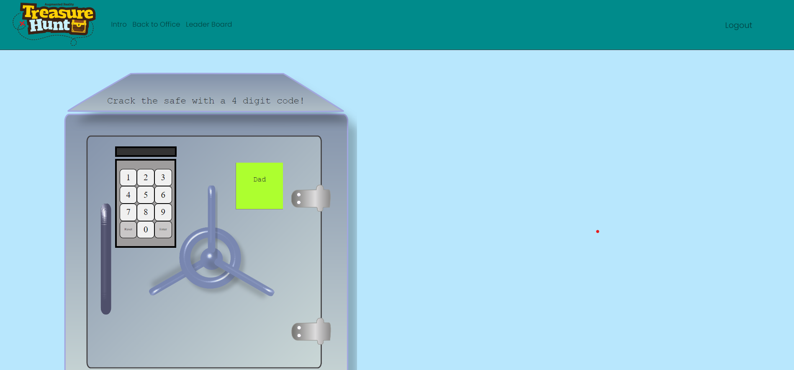
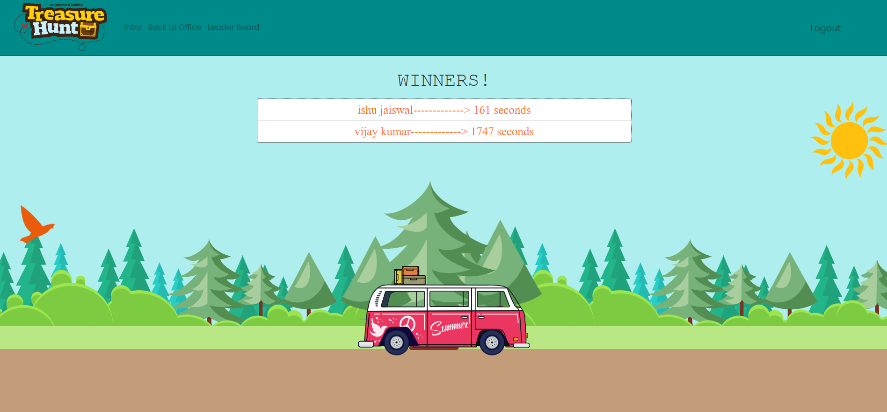

# Escape Room
Utkarsh Jaiswal

## Deployed Site

https://treasure-hunt-utkarsh.netlify.app/

## Table of Contents
* [Description](#description)
* [Deployed Site](#deployed-site)
* [Screenshots](#screenshots)
* [Installation](#installation)
* [Tech](#tech)

## Description
A virtual treasure hunt where users will have to piece together clues and riddles in order to find a key and find the map before anyone else.  Made using the MERN Stack. 2D game played by clicking / dragging on images to find clues and figure out puzzles and riddles. App has user authentication and stores save file with progress in Mongo database.

## Screenshots

## Installation

If you would like to install on your local machine then download source code and type in terminal :
` npm install ` to install dependencies and then start the app using ` npm start `.  

## Tech

* React
* Mongoose / Mongo DB
* Bcryptjs
* Bootstrap / React-Bootstrap
* Express
* JSON Web Token
* Passport
* React-drag-drop-container
* Sweet Alert 2
* Render
* Netlify
